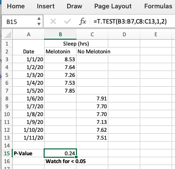

# Is it chance?  T-Test

**Problem**

You tried an intervention and want to see if it worked. How likely is it that the results were chance?

**Solution**

One of the simplest tests is a “T-Test”, sometimes called a “Student T Test”.  

Statisticians use the concept of _P Value_ to discuss the how often a result might appear to be significant even when it’s not. While this crude measure doesn’t describe all the ways something might happen due to chance, generally the lower the P Value, the better. Professional scientists, especially those who understand statistics, will get touchy if you claim a result based purely on P Values, but for Personal Science purposes, it’s a good start. There is no “correct” cutoff value that can determine the likelihood that something is due to chance alone, but traditionally people assume that anything under 0.05 deserves a closer look.

Here’s an example for how to do this in Excel.

Suppose you’d like to know if taking a melotonin supplement will help you sleep longer. You’ve measured your daily sleep, taking the supplements on some days (the “intervention”) and not on others (“control”).

A simple spreadsheet might look like this:

Track your sleep under two columns: one for nights when you took the supplement, and the other for nights you didn’t.

The built-in Excel statistical function `T.TEST` will calculate the P-Value when you give it two ranges, the “intervention” (nights we took melotonin) and the “control” (nights without).

See the screenshot for the exact formula in this case: 

`=T.TEST(array1,array2,tails,type)` 

Enter a `1` for `tails` (because we’re only interested in one measurement, sleep) and a `2` for type (because in this case our samples are not of the same length).

The P Value in this example, `0.24`, is above `0.05` and therefore we will assume that any difference in sleep between the nights is due to pure chance.

